# Listo! App To-Do List
Manage your tasks with your online to-do list
Repository link [here](https://github.com/Ali-Gate/listo)

Live App [here](https://listo-app-0473995061cf.herokuapp.com/todo/)

## Purpose: 
The purpose of the Listo! App To-Do List is to provide users with an intuitive and organized platform for managing their tasks and activities. The app aims to enhance productivity, to promote timely completion of tasks, and stress reduction by offering features such as task deadlines, reminders, progress tracking and categorization.


## Table of Contents
- [Purpose](#purpose)
- [Problem Statement](#problem-statement)
- [App Description](#app-description)
    - [User Accounts](#user-accounts)
    - [Admin Account](#admin-account)
    - [Todo List App Usage](#todo-list-app-usage)
- [Development Process](#development-process)
    - [Project Planning](#project-planning)
    - [User Stories](#user-stories)
    - [Views and Templates](#views-and-templates)
- [JavaScript Implementation](#javascript-implementation)
- [Debugging and Testing](#debugging-and-testing)
    - [Manual Testing](#manual-testing)
    - [Browser Compatibility](#browser-compatibility)
    - [Online Validators](#online-validators)
- [Deployment Process](#deployment-process)
- [Use of AI](#use-of-ai)
- [Credits and Resources](#credits-and-resources)


## Problem Statement: 
In today's fast-paced world, individuals and teams struggle to manage tasks efficiently. They often lose track of priorities, deadlines, and important activities, leading to decreased productivity and increased stress.

Target Audience: 
The app is designed for busy professionals, students, and the general public who seek an intuitive and efficient task management solution.
For future iterations I aim to extend the features for project teams and  organizations.

## App description
### **User accounts**
### MVP
The user will be able to Sign Up, log in and log out as well as access a customised view  of their account so that users can manage their personal todo list.

The user will see a notification after every of the above actions including a confirmation prompt when logging out.
### Future iterations
Users will be able to edit their account details and reset their passwords, as well as receive a confirmation email after any account specific activity.

Users will be able to access a team account using their personal account with authorisation to securely access team privileges through invitation.

### **Admin account**


The admin will be able to access and manage all user accounts and their tasks, monitor user activity, and ensure data integrity.

The admin will be able to access a dedicated admin panel to control app settings, generate reports, and manage user permissions.


### **Todo List App usage**
### MVP
The user will be able to create, edit, set the stage of progression of their tasks and once completed they will be able to delete them for the first iteration.

The user will see a notification after every of the above actions including a confirmation prompt when deleting tasks.

### Future iterations
Users will be able to categorise tasks by topic, priority and deadline as well as access specific views.
Users will be able to move the tasks from to-do to done views.
Users will be able to access team to-do lists which team members will be able to access from their personal accounts 
Users will be able to use a calendar/planner which could also be accessed by teams.

[Return to Table of Contents](#table-of-contents)


# Development Process

## Project planning and documentation in GitHub

Throughout the development process, GitHub played a crucial role in project management and version control. I utilized GitHub's features to track progress, manage issues, and maintain documentation. The repository was organized to ensure clear documentation of the development process, from initial planning through implementation.

Key aspects of the GitHub workflow included:
- Regular commits with descriptive messages
- Issue tracking for feature implementation through user stories
- README documentation updates
- Project board for task organization

## User Stories
### User for Registration and Login
- As a new user, I want to create an account, so that I can have a personalized experience and securely save my tasks. MUST

- As a user, I want to log in to my account, so that I can access my personalized tasks and settings. MUST

- As a user, I want to log out of my account, so that I can ensure the security of my information when I'm not using the app. MUST

- As a user, I want to reset my password, so that I can regain access to my account if I forget my password. COULD

- As a user, I want to update my account information, so that I can keep my profile details current. COULD

### User Stories for to-do list features

- As a user, I want to create a new task, so that I can keep track of things I need to do. MUST

- As a user, I want to view all my tasks, so that I can see what needs to be done. MUST

- As a user, I want to update a task, so that I can change its details if needed. MUST

- As a user, I want to delete a task, so that I can remove tasks that are no longer relevant. MUST

- As a user, I want to see a confirmation prompt before deleting a task, so that I don’t accidentally remove important tasks. MUST

- As a user, I want to mark a task as completed, so that I can visually track my progress. SHOULD

- As a user I want to filter the views of my tasks so that I can view tasks listed per category. COULD

### Admin Panel User Stories 
- As an admin, I want to view a list of all Signed Up users, so that I can monitor user activity and manage accounts.

- As an admin, I want to view and manage all tasks in the system, so that I can ensure data integrity and address any issues.

- As an admin, I want to generate reports on user activity and task completion, so that I can analyze app usage and improve user experience.

- As an admin, I want to manage app settings and configurations, so that I can customize the app's behavior and features.


[Return to Table of Contents](#table-of-contents)


## Project Planning


### **User Flow Diagram**

### **Overview**
The User Flow Diagram illustrates the path users take through the Listo! app, from initial landing to task management. It shows the key decision points, actions, and system responses that create a seamless user experience. The diagram highlights both authenticated and non-authenticated user paths, as well as core task management functionalities.


### **Wireframes**

### **Wireframe Planning**
My initial wireframes were hand-drawn to quickly visualize the layout and user interface across different devices. These sketches helped plan the responsive design and essential features before development. The wireframes show the core elements like navigation, task lists, and forms optimized for desktop, tablet, and mobile views.

**Desktop**


**Tablet** | **Mobile**
:---: | :---:
 | 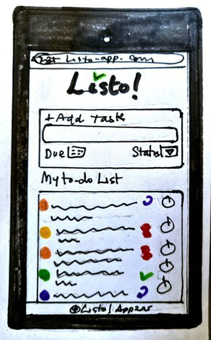

### **Data Models**

**Entity Relational Diagram**


### Task model class 
The association between users and tasks ensures privacy and personalization.
This connection allows for tailored task management features, such as personalized notifications. By maintaining this association, the app can provide a more organized and efficient task management experience, enhancing overall user satisfaction.

### User  model class
The User entity represents individuals who Sign Up and interact with the Listo! app. 
Each user has unique attributes such as a username, email, and password, ensuring secure access and personalized task management. 
This association allows users to manage their tasks independently, maintaining privacy and organization, while also enabling features like personalized notifications and progress tracking.


### Task Form model class (forms.py)
The association between tasks and task forms ensures structured data entry and consistency in task management.
This relationship helps maintain the integrity of task information and provides a user-friendly way to input and update task details.


[Return to Table of Contents](#table-of-contents)

# Views and Templates

## Overview

The app's interface is built using a collection of Django views and templates that work together to create a seamless user experience. Each view handles specific functionality, from task management to user authentication, while templates provide the visual structure and layout.

Key views include:
- Home view for landing page
- Authentication views for login/signup
- Task management views (list, create, edit, delete)
- Admin views for system management

Templates are designed to be fully responsive across devices while maintaining consistent styling and functionality. The interface prioritizes intuitive navigation and clear task management workflows.

### Base.html

The container for all of our html content is provided by base.html which holds all of the other views for a seamless and consistent user experience. Styling had been skillfully adjusted so that all the views present a harmonic layout against the basic structure.


### Home page

Desktop


Tablet | Mobile
:---: | :---:
 | 


### Log in

Desktop


Tablet | Mobile
:---: | :---:
 | 


### Sign Up

Desktop


Tablet

Tablet | Mobile
:---: | :---:
 | 


### To-do list

Desktop


Tablet | Mobile
:---: | :---:
 | 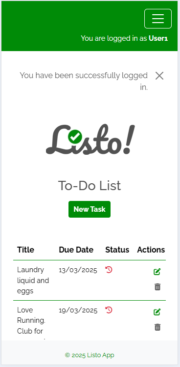


## Add task

Desktop

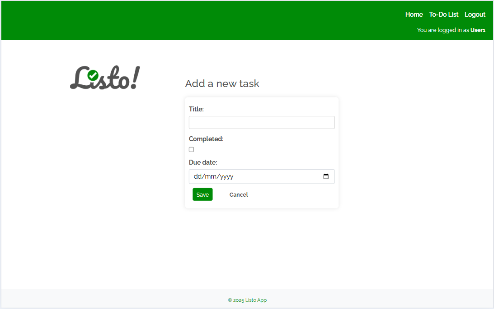
Tablet | Mobile
:---: | :---:
 | 


### Admin View

Desktop


Tablet | Mobile
:---: | :---:
 | 

# JavaScript Implementation

The JavaScript in this application serves two main purposes:

1. Action Feedback Messages
- Displays temporary notification messages after user actions
- Uses setTimeout for automatic message dismissal
- Provides visual feedback for task creation, updates, and deletions

2. Past Due Date Modal
- Triggers when user attempts to create a task with a past due date
- Implements confirmation dialog with Yes/No options
- Validates date inputs before task creation
- Uses Bootstrap's modal component for consistent UI

The JavaScript code is kept minimal and focused on essential user interaction feedback, enhancing the core Django-based functionality without overcomplicating the frontend.

[Return to Table of Contents](#table-of-contents)


# Debugging and Testing

Throughout the development process, rigorous debugging and testing were conducted to ensure the application's reliability and functionality. This involved both manual testing approaches to identify and resolve issues across different aspects of the application as well as online validation tools.

Key testing areas included:
- User authentication flows
- Task management operations
- Form validations
- Database interactions
- UI/UX responsiveness
- Error handling mechanisms

Debug tools and methodologies used:
- Terminal's problems tab
- Console logging
- Browser DevTools
- Manual test cases
- Cross-browser testing


## Manual Testing

Manual testing was conducted systematically across all features and user flows to ensure functionality, usability, and responsiveness. Each feature was tested multiple times under different conditions and user states (logged in/out) to verify expected behavior and identify potential issues.

The testing process included:
- Feature-by-feature verification
- User authentication flows
- Form validations and submissions
- Error handling and messaging
- Cross-device compatibility
- Navigation and routing
- Data persistence

Below is a detailed breakdown of the test cases and their results:


### Feature Testing


|Page|Feature|Action|Effect|Checked|
|---|---|---|---|---|
|All Pages|Site Logo|Click|Redirects to home page from all pages|----X----
|All Pages|Home link|Click|Redirects to home page from all pages|----X----
|Homepage|Call-to-Action login button|Logged out : click|Redirects to Login Page|----X----
|Homepage|Call-to-Action sign up button|Logged out : click|Redirects to Sign Up Page|----X----
|Homepage|Logged out User Display|Logged out : message: you are currently not logged in|Message appears in navbar|----X----
|Homepage|Login link|Logged out: link appears in navbar> click|Redirects to Sign In Page|----X----
|Homepage|Sign up link|Logged out: link appears in navbar> click|Redirects to Sign Up Page|----X----
|Homepage|Logged In User Display|Logged in: message: You are logged in as (username)|Username appears in navbar|----X----
|Homepage|Logout link|Logged in: link visible in navbar|Redirects to confirm signout page|----X----
|Homepage|Logout link|Logged out : not visible|link not visible|----X----
|Homepage|To-Do List link|Logged in: link visible in navbar|Redirects to To-Do list page|----X----
|Homepage|todo list Button|logged in: Click|Redirect to todo_list > All user's tasks displayed|----X----    
|Homepage|todo list Button|Logged in : click|Redirect to todo_list >Only user's tasks are displayed|----X----
|Homepage|todo list Button|Logged out: not visible|todo-list page innacessible from homepage if not logged in|----X----
|Sign Up Page|Username validation|Try using existing username|Error message appears - 'A user with that username already exists'|----X----|
|Sign Up Page|password1|Enter a short password|Error message - 'That password is too short'|----X----|
|Sign Up Page|password2|Enter a too common password|Error message - 'That password is too common'|----X----|
|Sign Up Page|password3|Enter an only numeric password|Error message - 'That password is entirely numeric'|----X----|
|Sign Up Page|password4|Enter different password to password1 field|Error message - 'The two password fields didn’t match.'|----X----|
|Sign Up Page|Sign Up button|Entered valid form data|Redirects to login page - success message displayed|----X----|
|Pop messages|Message on Sign Up|Sumbit Sign Up form|Successful Sign Up message appears|----X----|
|Sign Up Page|Sign In in-form link|Click link|Redirects to login page|
|Login Page|Username validation|Enter incorrect username|Error message response - does not specify if username or password failed|----X----
|Login Page|Password validation|Enter incorrect password|Error message response - does not specify if username or password failed|----X----
|Login Page|Login button|Click upon entering correct details|Redirects to todo_list page, shows successful login message|----X----|
|Pop messages|Message on login|Login as user|Successful Signin message appears|----X----
|Login Page|Sign Up in-form link|Click|Redirects to signup page|----X----|tiny 
|Todo_list page|Logged Out: not accessible. None of the features in this page will be visible to user not logged in|Logged out|Not accessible from UI|----X----
|Todo_list page|New Task Button|Click|Redirects to todo_form page|----X----
|Todo_list page |Edit Button|Click|redirects to todo_form Page|----X----
|Todo_list page |Delete button|Click|redirects to todo_delete Page|----X----
|Todo_delete Page|Delete button|Click|deletes task and redirects to todo_list Page|----X----
|Todo_delete Page|Cancel button|Click|redirects to todo_list Page|----X----
|todo_form page|task title validation|enter title|if empty, prevents submit and shows message|----X----
|todo_form page|task due date validation|enter due date|if empty, prevents submit and shows message|----X----
|todo_form page|due date validation|enter due date|if past, pops modal asking confirmation|----X----
|todo_form page|completed checkbox|check|determines progression status|----X----
|todo_form page|save button|click|creates new or updates existing task and redirects to todo_list, updating list with new task|----X----
|Pop messages|Message on update or create task|todo_form> click save|Successful task creation or updating message appears|----X----
|past due date modal|modal|confirm whether date in the past is accepted|shows message and gives two options|----X----
|past due date modal|modal YES button|click|confirm date in the past is accepted and creates new task, redirects to todo_list|----X----
|past due date modal|modal NO button|click|rejects date in the past and returnds to todo_form|----X----
|past due date modal|modal X button|click|dismisses and returnds to todo_form|----X----
|Logout from all pages if logged in|Sign Out button|Click|Redirects tologout_confirmation|
|Logout_confirm page|Confirm logout|Click 'ok'|Redirects to home page and shows message|----X----
|Pop messages|Message on loggout|Logout|Successful signout message appears|----X----
|Logout_confirm page|Confirm logout|Click 'cancel'|Redirects to todo_list page|----X----

### Responsiveness Testing

Extensive responsiveness testing was conducted using Chrome DevTools' device simulation features to ensure optimal display and functionality across different screen sizes and devices. The testing focused on layout integrity, readability, and user interaction elements at various breakpoints.

Key aspects tested included:
- Locating origin of code and often over-riding external resources
- Navigation menu behavior
- Content scaling and alignment
- Button and form element sizing
- Image responsiveness
- Indexed accessibility

Screenshots demonstrating responsive design are present in views and templates section above.

### User Roles

I used AuthenticationForm and UserCreationForm as well as created a superuser to establish the access control of each user type:

- Visitors can register their account, and then they become a user. Account is then created in database securely. 

- Users can then log in, log out and use their full CRUD functionality for each task. Users can securely access only their dashboard and code ensures only admin can view or alter the content of each user's data.

- Admin user was set as superuser via django command, and has it's specific view from where they can manage all accounts and contents. Built in as well as manual safety measures are present to ensure code is only managed by the superuser/admin.

env.py file saves secret key and database url, .gitignore hides sensitive information about the project's code and databases, and debug is set to FALSE so no external agents can not view any custom errors. 

### JS testing procedures

### JavaScript Testing Procedures

JavaScript functionality was tested primarily for two key features:
- Action feedback messages display and timeout
- Past due date confirmation modal behavior

Test cases included:
- Message display timing and visibility
- Message content accuracy
- Modal trigger on past due date selection
- Modal button functionality (Yes/No/Close)
- Modal display and dismissal
- Cross-browser message compatibility
- Message stack behavior for multiple actions

### Modal Loading Issue Resolution

During testing, a critical issue was identified where the modal wasn't accessible on page load. The solution involved embedding the modal inside a conditional check:

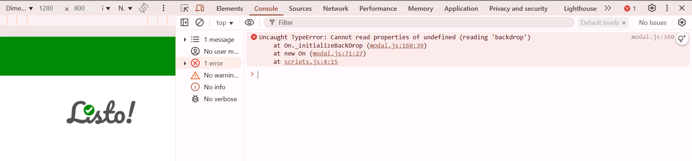


This ensures the modal is only initialized when the form element exists, preventing JavaScript errors on pages where the form isn't present.


## Browser Compatibility
The application was tested across multiple browsers to ensure consistent functionality and appearance:

- Google Chrome (regular and incognito mode)
- Mozilla Firefox
- Microsoft Edge

All core features, including authentication, task management, responsive design, and JavaScript functionality, performed consistently across these browsers with no significant variations in behavior or appearance.

## Lighthouse

Here are the lighthouse reports for the site's main pages :
#### Homepage

Desktop | Mobile
:---: | :---:
 | 


#### Todo List

Desktop | Mobile
:---: | :---:
 | 

#### Add task form

Desktop


Mobile | Performance Details
:---: | :---:
 | 

Here it shows how performance drops for task form on mobile devices, slowing down the loading of resources. For future iterations inline Javascript will be tested as well as decreasing the dependancy on bootstrap.

## Online Validators

Several online validation tools were used to ensure code quality and standards compliance:

### HTML Validation
The W3C Markup Validation Service was used to verify HTML structure and syntax across all pages. Key validation steps included:

- Running each page URL through the validator to ensure no errors are present
- Checking template files individually

- Verifying proper nesting and closing of elements

 Any validation errors were promptly fixed during development. Upon fixing the errors, results showed valid HTML5 markup with only minor warnings that didn't affect functionality:

- No major errors found and now all of them fixed
- All elements properly nested
- Valid semantic structure
- Compliant meta tags and charset declarations

**HTML Validation Results**
**Homepage HTML Validation** | **Todo List HTML Validation**
:---: | :---:
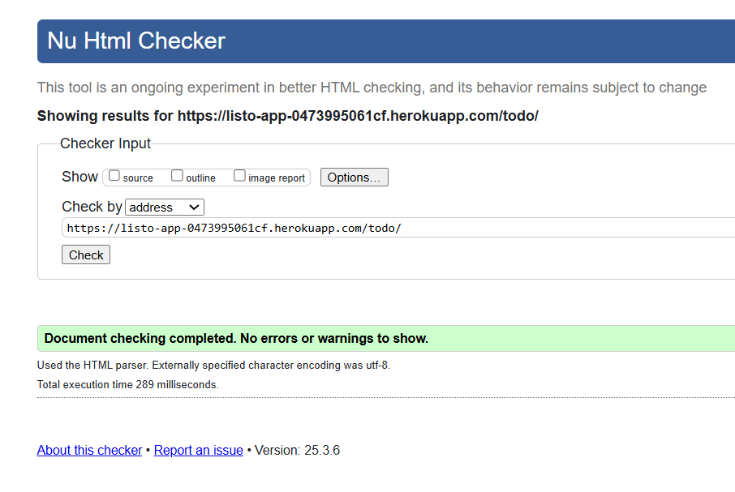 | 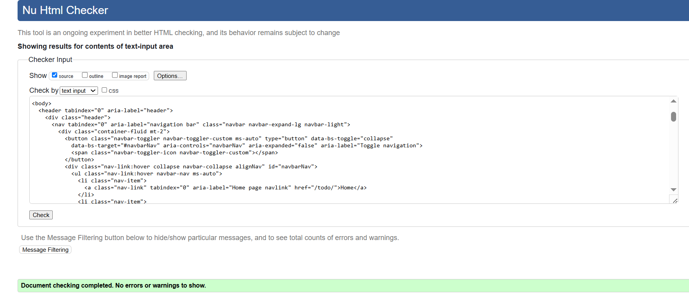

There's a persistent warning about the html aria labelling of my modal but I chose to leave it on for accessibility. Here it is:

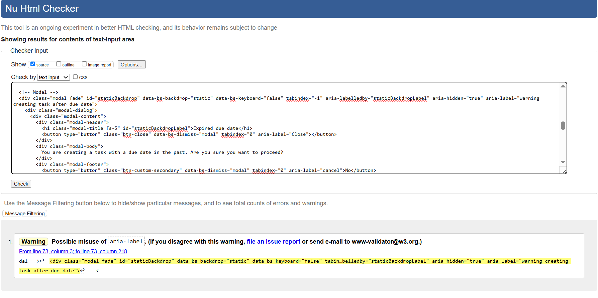

### CSS Validation
- I copied my style.css code into the W3C Jigsaw CSS Validation Service  and verified stylesheet compliance
- No errors found in custom CSS code

**CSS Validation Results**


### JavaScript Validation
- JSHint used to detect errors and potential problems

- No major errors were highlighted only bootstrap variables undefined but I did not act on it in order to not affect functionality.

- Code formatted according to standard style guidelines


**Javascript Validation Results**
    
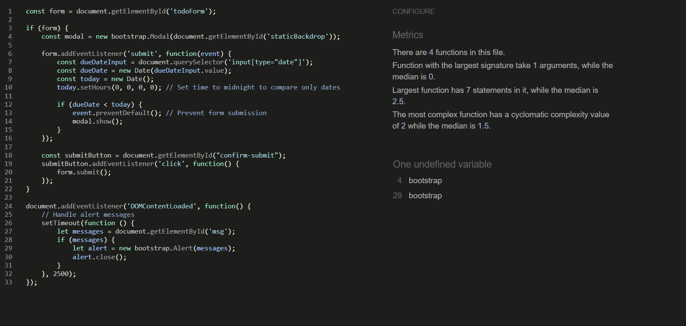

### Python Linting
- I installed Flake8 in my VS Code Workspace and checked each python file going over each of the errors and getting Copilot's assistance to fix indentation and spaces errors. 
- There are 2 indentation persistent errors which I later passed through CI online linter tool but still was not able to fix after trying many options. It does not affect the funtioning of the code so I let them be.

**Results**

Here's the only remaining errors I could not work out.


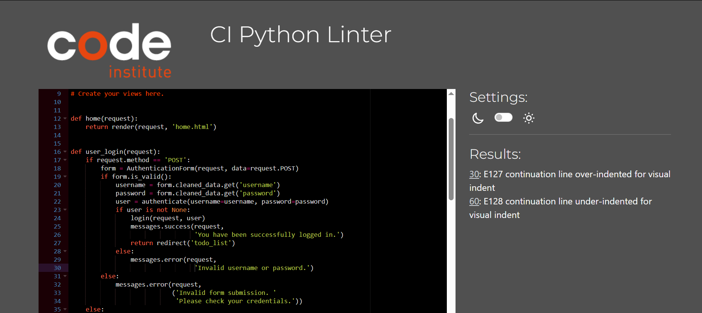


### Accessibility
- My first point of reference to work with the accessibility of my app was Lighthouse reports.
- I used Stackflow to learn how to add tab index to my web application and ensured all important stops were added. However after running through lighthouse and wave I realised I had added too many and it was interfering with the flow of tab navigation.

- I changed the font family and the colour scheme of my site a few times to make it WCAG compliant.

I finally used WebAIM Contrast Checker verifto verify the color combination was the right one, much to my chagrin as the tone of green was important to the meaning, but I think it still makes it work. 

**Contrast Checker Results**

Failed | Passed
:---: | :---:
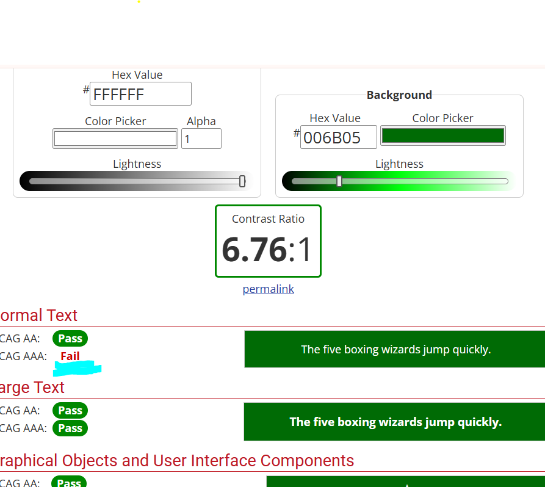 | 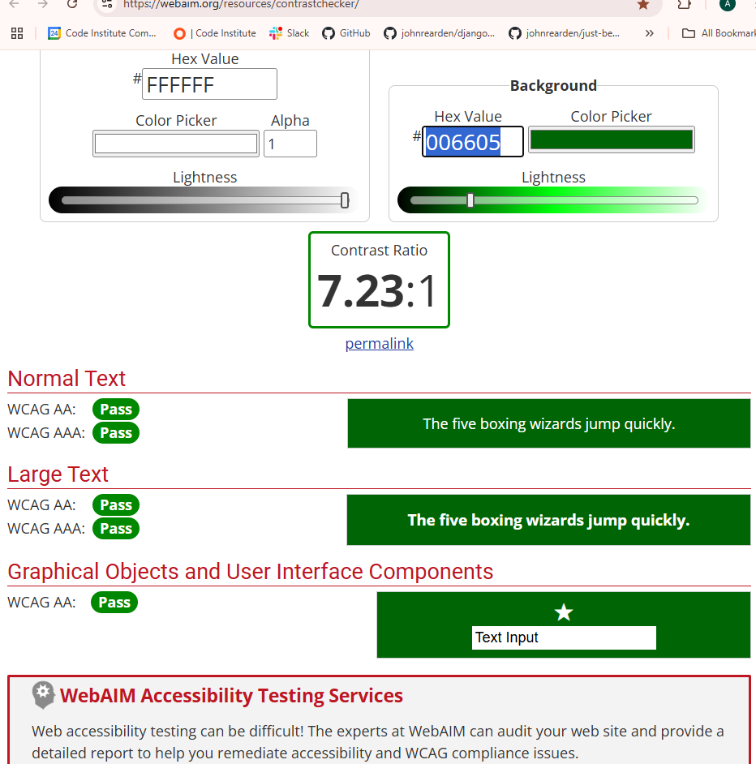


- WAVE Web Accessibility Tool tested accessibility features and although it gave no further errors it gave lots of recommendations for improvements.

### User stories as testing tool

User stories served as an effective testing framework throughout development. Each story's acceptance criteria provided clear test cases to verify functionality. For example, the "create new task" story required testing task creation with various inputs, while the "delete task" story necessitated verification of both the deletion process and confirmation prompts. By systematically testing against user stories, I ensured that the implemented features met user requirements and worked as intended. This approach helped maintain focus on user needs while validating core functionality.

Here's the link to my GitHub Project Board 

https://github.com/users/Ali-Gate/projects/11

## Debugging

### Major debugging issue

### Major debugging challenges:

During development, several significant issues required debugging, as well as other minor fixes needed on a day to day basis. Here is an account of the main issues:

- Database Connection: Initial deployment faced database connection issues. Resolved by correctly configuring environment variables and database URLs.

- Static Files: Static files weren't loading properly in production. Fixed by updating STATIC_ROOT settings and implementing proper collectstatic commands.

- Form Submission: CSRF token validation errors occurred during form submissions. Fixed by ensuring proper middleware configuration and token inclusion.

- Message Display Issue:
Originally I tried to use toasts for messages but I could not connect them to my CRUD functions on database so they were just merely working on frontend.
I decided to use simple JavaScript to ensure messages were displayed and dismissed automatically. I had issues placing them in the right space until finally using css I managed to limit the view so they displayed discreetly and nicely at the top of main.

- Task Creation with Past Due Date:
Users could create tasks with due dates in the past without any confirmation.
I decided to kleep that functionality but added a confirmation dialog using JavaScript and bootstrap modal to prompt users when creating tasks with past due dates.
It was giving some errors which I fixed as explained in the JS section above.

- Form Validation:
Forms were not validating correctly, leading to giving  errors.
Ensured form validation logic is correctly implemented and provided feedback to users.

- Navigation Menu Toggle Button:
The navigation menu toggle button was not consistently white in all states.
It took a lot of CSS adjusting and overriding Bootstrap to ensure the toggle button and its icon remain white in all states.
It kept refusing so it took a lot of work, but great learning. 


- Logout Confirmation:
Problem: Users were logged out immediately without confirmation.
Solution: Added a logout confirmation page to prompt users before logging out.

[Return to Table of Contents](#table-of-contents)


# Deployment Process

## Deployment to Heroku

The application was deployed to Heroku using the following steps:

1. **Environment Setup**
    - Created requirements.txt file
    - Created Procfile
    - Set DEBUG to False in settings.py
    - Updated ALLOWED_HOSTS

2. **Heroku Configuration**
    - Created new Heroku app
    - Connected to GitHub repository
    - Added PostgreSQL database
    - Configured environment variables:
      - SECRET_KEY
      - DATABASE_URL
      - DISABLE_COLLECTSTATIC=0

3. **Database Migration**
    - Ran migrations on Heroku PostgreSQL
    - Created superuser for admin access

4. **Deployment**
    - Enabled automatic deploys from main branch
    - Verified build logs
    - Confirmed application launch

5. **Post-Deployment**
    - Tested all functionality
    - Verified static files serving
    - Checked database connections
    - Validated user authentication

The live application is now accessible at: [Listo App](https://listo-app-0473995061cf.herokuapp.com/todo/)

## Running Locally in Virtual Environment

To run this application in your local environment:

1. **Clone the Repository**
```bash
git clone https://github.com/Ali-Gate/listo.git
cd listo
```

2. **Set Up Virtual Environment**
```bash
python -m venv venv
source venv/bin/activate  # On Windows use: venv\Scripts\activate
```

3. **Install Dependencies**
```bash
pip install -r requirements.txt
```

4. **Environment Variables**
Create a `.env` file with:
```
SECRET_KEY=your_secret_key
DATABASE_URL=your_database_url
DEBUG=True
```

5. **Database Setup**
```bash
python manage.py migrate
python manage.py createsuperuser
```

6. **Run Development Server**
```bash
python manage.py runserver
```

Access the application at `http://localhost:8000`


# Technologies Used

## Core Technologies
- Python 3.11.4
- Django 4.2.4
- JavaScript
- HTML5
- CSS3
- PostgreSQL

## Frameworks and Libraries
- Bootstrap 5.3.1
- jQuery 3.7.0
- Django Crispy Forms
- Gunicorn
- Psycopg2
- Whitenoise

## Development Tools
- Visual Studio Code
- Git and GitHub
- Chrome DevTools
- Django Debug Toolbar
- Flake8 Linter

## Hosting and Deployment
- Heroku Platform
- Heroku PostgreSQL
- Cloudinary (for static files)

## Testing Tools
- Django TestCase
- JSHint
- W3C Validators
- Chrome Lighthouse
- WAVE Accessibility Tool

[Return to Table of Contents](#table-of-contents)


# Use of AI


GitHub Copilot was instrumental in the development process of this application, providing assistance in several key areas:

### Code Development
- Suggested optimal Django model structures and relationships
- Helped write efficient database queries
- Generated boilerplate code for views and forms
- Provided template structure recommendations
- Assisted with Bootstrap class implementations

### Code Optimization
- Suggested performance improvements for database operations
- Helped refactor repetitive code patterns
- Recommended better ways to handle user authentication
- Provided solutions for responsive design issues

### Debugging
- Identified potential bugs in code logic
- Suggested fixes for validation issues
- Helped troubleshoot deployment problems
- Assisted with JavaScript event handling fixes

### UX Improvements
- Recommended user feedback mechanisms
- Suggested form validation enhancements
- Helped implement message notifications

All suggestions were carefully reviewed and tested before implementation to ensure code quality and security.

## Reflection on the rol of AI in the development of the project

Copilot has been my main AI tool with the exception of a few debugging issues for which I used Chat GPT. 

I needed to be extremely discerning with Copilot and go back on my steps many times, specially when implementing bootstrap CSS features for styling. The responsiveness of the templated were really a difficult problem to fix and I ended up using a lot of my own css styling and learning how to over-ride the bootstrap rules that copilot had implemented in my code.

It often overcomplicates the code needed and creates changes without giving any notice. However I am very satisfied with the assistance it has provided and how much it has fortered my learning of coding.

The inline suggestions very often stood in the way creating snippets and especially HTML tags where they werent needed and momentarily breaking my code. 

I am still learning how to simplify the prompt so that it gives me exactly what I needed. At the early stages of the process it was a challenge to combine AI with the LMS walkthrough projects, and I ended up using imports we hadn't worked with before, as the Authentication used. It was only after most of my functionality was created that I rtealised I hadn't used AllAuth, but the functionality was there so it was to late to go back. 

Along the development process I learnt to be less and less reliant on Copilot's help and to keep things simple. 

[Return to Table of Contents](#table-of-contents)

# Credits and Resources

## Code Resources
- Django Documentation - Official Django documentation for core functionality
- Bootstrap Documentation - Component styling and responsiveness
- Stack Overflow - Problem-solving and debugging assistance
- MDN Web Docs - JavaScript reference and tutorials
- W3Schools - Javascript, CSS, Python and HTML guidelines and exercises

## Media and Design
- Font Awesome - Icons used throughout the application
- Google Fonts - Typography elements
- https://online.visual-paradigm.com/ - For creating diagrams and flowchart
- Krita software for creating my logo

## Learning Resources
- Code Institute - Project structure and deployment guidance
- YouTube Django Tutorials - Various implementation examples
- GitHub Documentation - Version control and project management
- Django for Beginners (Book) by William S. Vincent

## Acknowledgments
- Code Institute mentors for project guidance
- CI Slack community for troubleshooting help
- Fellow students for testing and feedback

[Return to Table of Contents](#table-of-contents)


